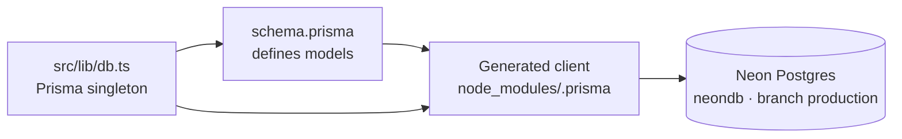

# 🗄️ Database Guide: How It Works & How to Control It

> [!abstract] Stack
> **PostgreSQL on Neon (managed, serverless) + Prisma ORM.** Live DB used by every
> environment: `neondb` on project `morning-shadow-27344830` (`.neon` file, branch
> **production**). All schema-to-DB control flows through Prisma — never hand-write
> DDL onto the live cluster.

[[WELCOME|🏁 Welcome]] · [[README|📚 Wiki Index]] · [[SECURITY|Security Plan]] · [[GAPS|Gaps & Missing Work]]

---

## Important: this DB is for user + store data, NOT the F1 content

> [!warning] Two data layers — don't mix them
> The login page's F1 hero (schedule, countdown, standings) comes from the
> **Jolpica F1 API**, not this database. This Postgres layer holds **accounts,
> store catalog, carts, orders** — plus future F1 models (Race, Circuit,
> NewsArticle) once Phase 1a adds them. See [[WELCOME|How the website works]].

## Architecture



- **ORM**: Prisma 5 (client `@prisma/client`, CLI `prisma`). One shared instance in
  `src/lib/db.ts` (reused across serverless cold starts).
- **Provider**: `postgresql`. Connection URL from `DATABASE_URL` (`.env.local` / `.env` /
  Vercel secret). A pooled (PgBouncer-style) URL is used; `DATABASE_URL_UNPOOLED` exists
  for migration commands if needed.
- **Migrations**: version-controlled SQL in `prisma/migrations/`. The baseline
  `20260915024910_community_init` matches the live schema. Local DB is verified in sync
  (`prisma migrate status` → "up to date").

## Local vs Production

| Aspect | Local (dev) | Production |
| :----- | :---------- | :--------- |
| **Database** | SQLite file `prisma/dev.db` — auto-created, zero-config | Neon `neondb` (branch `production`) |
| **Schema** | `prisma/schema.prisma` (default) | `prisma/schema.postgresql.prisma` (explicit `--schema` flag) |
| **Connection** | `DATABASE_URL="file:./dev.db"` in `.env.local` | Vercel env secret `DATABASE_URL` (pooled) |
| **Migrations** | `npm run db:push` (no migration files; keep `prisma/migrations/` Postgres-only) | CI `npm run db:migrate:prod` (replays in order) |
| **Seed** | `npm run db:seed` — **destructive**, local only | Never run against prod with real users |
| **Inspecting** | `npm run db:studio` | Neon console SQL editor (read-only) |

> [!note] Which one is pointed to?
> Check `.env.local`. `file:./dev.db` = local sandbox (default after clone).
> A `postgresql://...neon.tech` URL means you're on the cloud DB even in dev.
> Dev SQLite differs from prod Postgres on purpose: no `Decimal` (money fields
> are `Float` locally), no native enums/`Json` (stored as `String`). Never trust
> dev money math to the cent. Keep both schemas' MODELS in sync.

## New-colleague onboarding (clone → login in 4 commands)

No accounts, no installs, no shared secrets. The dev database is a local
SQLite file the tooling creates for you:

1. `cp .env.example .env.local` (already points at `file:./dev.db`) + set a real `NEXTAUTH_SECRET`.
2. `npm run db:push` — creates `prisma/dev.db` and syncs the schema.
3. `npm run db:admin` — upserts `admin@f1store.com` / `admin123` as `ADMIN`
   without wiping anything (override with `ADMIN_EMAIL` / `ADMIN_USERNAME` /
   `ADMIN_PASSWORD`). A `SELECT 1` runs first, so success = DB reachable.
4. `npm run dev` → sign in at `/login` with the admin email + password.
   If the sign-in succeeds, the DB round-trip (connect → read → bcrypt) works.

Need Postgres parity (Docker `docker compose up -d`, or a personal Neon branch
the owner shares privately)? Point `.env.local` at that URL **and** regenerate
the client for it: `npm run db:generate:prod`. Switch back with
`npm run db:generate`. Connection strings are passwords: local `.env.local`
only (gitignored), **never in a commit, chat log, or wiki page**.

## The `users` Table (auth-critical)

| Column | Type | Notes |
|--------|------|-------|
| `id` | text (cuid) | PK, generated |
| `email` | text | **unique** — login identifier |
| `username` | text | **unique** — public handle, set at registration |
| `passwordHash` | text? | bcrypt (cost 12) — **only** stored credential |
| `name` | text? | display name |
| `role` | enum `CUSTOMER \| ADMIN` | default `CUSTOMER` |
| `emailVerified` | timestamptz? | null until verified |
| `createdAt` / `updatedAt` | timestamptz | Prisma-managed |

Related tables for auth: `accounts` (OAuth), `sessions` (DB sessions, unused with JWT
strategy), `verification_tokens` (password/email tokens). Store tables: `categories`,
`teams`, `drivers`, `products`, `product_variants`, `product_images`, `carts`,
`cart_items`, `orders`, `order_items`, `addresses`, `wishlist_items`, `collections`,
`collection_products`.

## Everyday Commands

```bash
# Run from the repo root. Prisma CLI = node node_modules/prisma/build/index.js (pnpm scripts)

npm run db:generate   # Build the typed client from schema.prisma (SQLite dev) → run after ANY schema edit
npm run db:push       # Push dev schema to prisma/dev.db (the normal dev path — no migration files)
npm run db:studio     # GUI browser for tables/rows (localhost:5555) — safest manual edit path
npm run db:seed       # Reset teams/drivers/products + admin/customer demo users (bcrypt, destructive)
npm run db:admin      # Non-destructive admin upsert (admin@f1store.com / ADMIN)
```

### Schema change workflow (the only sanctioned path — dual-schema!)

There are two schemas: `prisma/schema.prisma` (SQLite, dev default) and
`prisma/schema.postgresql.prisma` (Neon prod). Mirror every MODEL change in
both; only provider + native types differ (`Decimal`/`@db.*`/enums/`Json`
exist in prod only).

1. Edit `prisma/schema.prisma` (dev) and mirror the models in `prisma/schema.postgresql.prisma`.
2. Dev: `npm run db:push` → applies to `dev.db`. Prod migration SQL: `npm run db:migrate --name what_changed`
   (runs against the Postgres schema — set a Postgres `DATABASE_URL` first).
3. `npm run db:generate` → client matches the dev schema.
4. Commit both schemas (+ migration, if any) together. Prod deploy: `npm run db:generate:prod`
   then `npm run db:migrate:prod`.

> [!warning] Don't hand-edit
> Per [[DEVELOPMENT|Development Guidelines]]: **never edit generated migration SQL by
> hand**, never DDL straight onto the DB. Migration history is the single source of truth.

### Inspecting the DB

```bash
npm run db:studio                          # visual table browser/editor
# raw SQL on the dev file (read-only) works too — needs sqlite3 CLI:
# sqlite3 prisma/dev.db 'select id, email, role from users;'
```

## Neon Console (managed control plane)

- Project: **morning-shadow-27344830**, database `neondb`, branch **production**.
- What it's for: connection strings, SQL editor, usage/cost, backups (point-in-time
  restore), branch management (e.g. create a `staging` branch instead of sharing prod).
- **Connecting**: connection strings live in `.env.local` (`DATABASE_URL`,
  `DATABASE_URL_UNPOOLED`) and in Vercel env vars. Rotate immediately if ever leaked.
- **Backups**: enable/confirm PITR (point-in-time recovery) in the Neon dashboard — do not
  rely on the local machine for backups.

## Roles & Responsibility (who can touch what)

| Action | Tool | Who |
|--------|------|-----|
| Inspect rows (dev) | `prisma studio` / SQL SELECT | dev |
| Schema changes | `prisma migrate` (committed PR) | dev only via PR + CI |
| Production schema apply | CI `db:migrate deploy` | CI |
| Connection strings / rotation | Neon console + Vercel secrets | owner (`@valenzuelajp`) |
| Backups / PITR / branches | Neon console | owner |

## Operational Notes

- **Seed is destructive**: it `deleteMany()`s all store + auth data before inserting
  (except it now recreates admin/customer with `username`). Never run `db:seed` against a
  production DB with real user data.
- **Do not commit `.env.local` / `.env`** (gitignored). `.env.example` is the committed template.
- **Pooler vs unpooled**: use pooled for app queries; prefer `DATABASE_URL_UNPOOLED` for
  long-running migrations (otherwise session pinning can stall `migrate deploy`).
- The baseline migration was regenerated from the live schema on 2026-09-18 (username was
  added to `User` to match the already-migrated Neon table) — DB, schema, and client are
  now in agreement.

---

*Last updated: 2026-09-23 · Part of the [[README|F1Store Wiki]]*