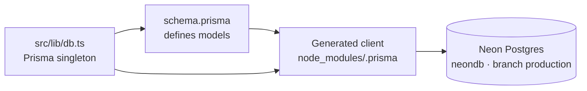

# 🗄️ Database Guide: How It Works & How to Control It

> [!abstract] Stack
> **PostgreSQL on Neon (managed, serverless) + Prisma ORM.** Live DB used by every
> environment: `neondb` on project `morning-shadow-27344830` (`.neon` file, branch
> **production**). All schema-to-DB control flows through Prisma — never hand-write
> DDL onto the live cluster.

[[WELCOME|🏁 Welcome]] · [[README|📚 Wiki Index]] · [[SECURITY|Security Plan]] · [[GAPS|Gaps & Missing Work]]

---

## Important: this DB is for user + store data, NOT the F1 content

> [!warning] Two data layers — don't mix them
> The login page's F1 hero (schedule, countdown, standings) comes from the
> **Jolpica F1 API**, not this database. This Postgres layer holds **accounts,
> store catalog, carts, orders** — plus future F1 models (Race, Circuit,
> NewsArticle) once Phase 1a adds them. See [[WELCOME|How the website works]].

## Architecture



- **ORM**: Prisma 5 (client `@prisma/client`, CLI `prisma`). One shared instance in
  `src/lib/db.ts` (reused across serverless cold starts).
- **Provider**: `postgresql`. Connection URL from `DATABASE_URL` (`.env.local` / `.env` /
  Vercel secret). A pooled (PgBouncer-style) URL is used; `DATABASE_URL_UNPOOLED` exists
  for migration commands if needed.
- **Migrations**: version-controlled SQL in `prisma/migrations/`. The baseline
  `20260915024910_community_init` matches the live schema. Local DB is verified in sync
  (`prisma migrate status` → "up to date").

## Local vs Production

| Aspect | Local (dev) | Production |
| :----- | :---------- | :--------- |
| **Database** | Docker Postgres 16 (`docker-compose.yml`) **or** Neon | Neon `neondb` (branch `production`) |
| **Connection** | `DATABASE_URL` in `.env.local` → `localhost:5432` or Neon | Vercel env secret `DATABASE_URL` (pooled) |
| **Migrations** | `pnpm db:migrate` (creates SQL) | CI `pnpm db:migrate deploy` (replays in order) |
| **Seed** | `pnpm db:seed` — **destructive**, local only | Never run against prod with real users |
| **Inspecting** | `pnpm db:studio` / `psql` | Neon console SQL editor (read-only) |

> [!note] Which one is pointed to?
> Check `.env.local`. If `DATABASE_URL` starts with `postgresql://...neon.tech` you're
> on the cloud DB even in dev. Use the Docker local URL (`.env.example`) when you want
> an isolated sandbox, or Neon when you want parity with production.

## The `users` Table (auth-critical)

| Column | Type | Notes |
|--------|------|-------|
| `id` | text (cuid) | PK, generated |
| `email` | text | **unique** — login identifier |
| `username` | text | **unique** — public handle, set at registration |
| `passwordHash` | text? | bcrypt (cost 12) — **only** stored credential |
| `name` | text? | display name |
| `role` | enum `CUSTOMER \| ADMIN` | default `CUSTOMER` |
| `emailVerified` | timestamptz? | null until verified |
| `createdAt` / `updatedAt` | timestamptz | Prisma-managed |

Related tables for auth: `accounts` (OAuth), `sessions` (DB sessions, unused with JWT
strategy), `verification_tokens` (password/email tokens). Store tables: `categories`,
`teams`, `drivers`, `products`, `product_variants`, `product_images`, `carts`,
`cart_items`, `orders`, `order_items`, `addresses`, `wishlist_items`, `collections`,
`collection_products`.

## Everyday Commands

```bash
# Run from the repo root. Prisma CLI = node node_modules/prisma/build/index.js (pnpm scripts)

pnpm db:generate   # Build the typed client from schema.prisma → run after ANY schema edit
pnpm db:migrate    # Create + apply a migration (interactive, dev only)
pnpm db:push       # Push schema without a migration (prototyping only — drift-y)
pnpm db:studio     # GUI browser for tables/rows (localhost:5555) — safest manual edit path
pnpm db:seed       # Reset teams/drivers/products + admin/customer demo users (bcrypt)
```

### Schema change workflow (the only sanctioned path)

1. Edit `prisma/schema.prisma`.
2. `pnpm db:migrate --name what_changed` → creates migration SQL + applies it.
3. `pnpm db:generate` → client matches schema.
4. Commit schema + migration together. CI `pnpm db:migrate deploy` replays it in order.

> [!warning] Don't hand-edit
> Per [[DEVELOPMENT|Development Guidelines]]: **never edit generated migration SQL by
> hand**, never DDL straight onto the DB. Migration history is the single source of truth.

### Inspecting the DB

```bash
pnpm db:studio                          # visual table browser/editor
pnpm exec prisma migrate status         # local vs repo drift check
# raw SQL (read-only) works too:
psql "$env:DATABASE_URL" -c 'select * from users;'
```

## Neon Console (managed control plane)

- Project: **morning-shadow-27344830**, database `neondb`, branch **production**.
- What it's for: connection strings, SQL editor, usage/cost, backups (point-in-time
  restore), branch management (e.g. create a `staging` branch instead of sharing prod).
- **Connecting**: connection strings live in `.env.local` (`DATABASE_URL`,
  `DATABASE_URL_UNPOOLED`) and in Vercel env vars. Rotate immediately if ever leaked.
- **Backups**: enable/confirm PITR (point-in-time recovery) in the Neon dashboard — do not
  rely on the local machine for backups.

## Roles & Responsibility (who can touch what)

| Action | Tool | Who |
|--------|------|-----|
| Inspect rows (dev) | `prisma studio` / SQL SELECT | dev |
| Schema changes | `prisma migrate` (committed PR) | dev only via PR + CI |
| Production schema apply | CI `db:migrate deploy` | CI |
| Connection strings / rotation | Neon console + Vercel secrets | owner (`@valenzuelajp`) |
| Backups / PITR / branches | Neon console | owner |

## Operational Notes

- **Seed is destructive**: it `deleteMany()`s all store + auth data before inserting
  (except it now recreates admin/customer with `username`). Never run `db:seed` against a
  production DB with real user data.
- **Do not commit `.env.local` / `.env`** (gitignored). `.env.example` is the committed template.
- **Pooler vs unpooled**: use pooled for app queries; prefer `DATABASE_URL_UNPOOLED` for
  long-running migrations (otherwise session pinning can stall `migrate deploy`).
- The baseline migration was regenerated from the live schema on 2026-09-18 (username was
  added to `User` to match the already-migrated Neon table) — DB, schema, and client are
  now in agreement.

---

*Last updated: 2026-09-23 · Part of the [[README|F1Store Wiki]]*