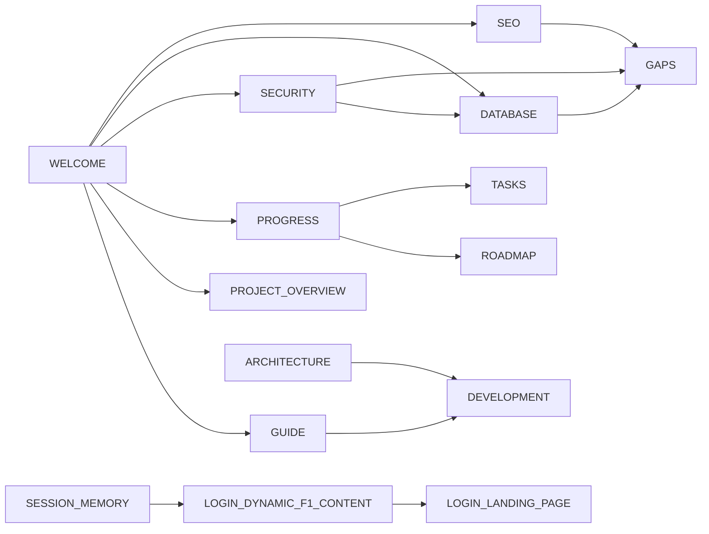

# 📚 F1Store Wiki — Index

Welcome to the **F1Community** project wiki — the central knowledge base for
tracking progress, plans, decisions, and tasks.

> [!info] What F1Community is
> An **F1 Community website** with **three experiences** under one roof, sharing
> **one account**: the **F1 Community** hub (schedule, standings, news, live),
> the **F1 Store Community**, and the **F1 Official Store**.
> Start with [[WELCOME|🏁 Welcome]] to understand how it all works.

## 🚀 Start Here

| Document | Purpose |
| :------- | :------ |
| [[WELCOME\|🏁 Welcome — How the Website Works]] | **First-time reading guide**: two data layers, auth flow, run instructions, code map |
| [[GUIDE\|Developer & Architecture Guide]] | Beginner-friendly deep tutorial: architecture, auth, Zod, RSC, forms |
| [[GAPS\|🕳️ Gaps & Missing Work]] | **Living audit** — what's missing/broken, prioritized (P0/P1/P2) |

## 📊 Project Management

| Document | Purpose |
| :------- | :------ |
| [[PROJECT_OVERVIEW\|Project Overview]] | High-level description, goals, and scope |
| [[PROGRESS\|Progress Tracker]] | Current status, milestones, and completion metrics |
| [[ROADMAP\|Roadmap & Plans]] | Phased development plan and future features |
| [[TASKS\|Task Board]] | Active tasks, backlog, and sprint tracking |

## 🛠️ Engineering

| Document | Purpose |
| :------- | :------ |
| [[ARCHITECTURE\|Architecture Decisions (ADR)]] | Technical decisions and rationale (ADR log) |
| [[DEVELOPMENT\|Development Guidelines]] | Coding standards, workflows, and conventions |
| [[SECURITY\|🛡️ Security Plan]] | Threat model, implemented auth controls, staged hardening checklist |
| [[DATABASE\|🗄️ Database Guide]] | How the Neon + Prisma database works and how to control it |
| [[SEO\|🔍 SEO Plan]] | Metadata strategy, robots/sitemap, OG cards, checklist |
| [[FILE_TREE\|Current File Tree]] | Current repository folders and files |
| [[F1_API_REFERENCE\|F1 API Reference]] | Formula 1 data sources, endpoints, and integration patterns |
| [[FIGMA_MCP_SETUP\|Figma MCP Setup]] | Connect Figma to opencode for design-to-code workflow |

## 🎨 Login Page

| Document | Purpose |
| :------- | :------ |
| [[LOGIN_LANDING_PAGE\|Login Landing Page]] | 2026-09-20 plan, implementation, validation, and follow-up |
| [[LOGIN_DYNAMIC_F1_CONTENT\|Login — Dynamic F1 Content]] | Beginner walkthrough: live schedule hero, countdown, time zones, naming |
| [[SESSION_MEMORY\|Session Memory (2026-09-22)]] | **Pick up where we left off** — state, knobs, verification, open items |
| [[PLAN\|3D Cinematic Login Plan]] | Future vision: Three.js/WebGL login experience (not yet implemented) |

## 📈 Wiki Map

## Project Links

- **Repository**: `A:\Github\F1Community` (GitHub: `valenzuelajp/F1Community`)
- **Wiki Location**: `A:\Github\F1Community\f1storewiki`
- **Live Site**: _TBD_

## Quick Status

> [!important] Snapshot
> - **Last Updated**: 2026-09-23
> - **Current Phase**: Phase 0 - Foundation (~50%)
> - **Active Sprint**: Auth Completion + Foundation Cleanup
> - **Latest**: DB-backed login + `/register` live in code; `/login` hero runs live F1
>   schedule data with time-zone-aware countdown; wiki expanded with [[WELCOME|Welcome]],
>   [[SEO|SEO Plan]], and [[GAPS|Gaps Audit]].
> - **Open (P0)**: rate-limit auth, prod secret policy, demo-credential leak, robots/sitemap,
>   `pnpm lint` config mismatch — all tracked in [[GAPS|Gaps]].

---

## For AI Assistants

This wiki is designed to be read by both humans and AI agents. When working on this project:

1. **Start here** — Read [[WELCOME|Welcome]] and this index
2. **Check Progress** — Review [[PROGRESS|PROGRESS.md]] for current state
3. **Consult Roadmap** — Understand the planned phases in [[ROADMAP|ROADMAP.md]]
4. **Pick Tasks** — Check [[TASKS|TASKS.md]] for actionable work
5. **Follow Guidelines** — Adhere to [[DEVELOPMENT|DEVELOPMENT.md]] standards
6. **Document Decisions** — Record architectural choices in [[ARCHITECTURE|ARCHITECTURE.md]]

### Context Preservation

After completing any significant work:

- Update [[PROGRESS|PROGRESS.md]] with new completion status
- Move completed tasks in [[TASKS|TASKS.md]]
- Add any new decisions to [[ARCHITECTURE|ARCHITECTURE.md]]
- Update [[ROADMAP|ROADMAP.md]] if plans change
- Tick items in [[GAPS|GAPS.md]] as they land

---

*This wiki is maintained alongside the codebase. Keep it current! · Last updated: 2026-09-23*