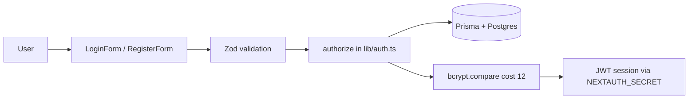

# 🛡️ Security Plan: F1Community

> [!abstract] Status
> **Active baseline** — hardening checklist for the auth flow now in production
> code. Covers the current state (2026-09-18: DB-backed credentials login +
> registration) and staged hardening across all three experiences
> ([[WELCOME|Community hub, Store Community, Official Store]]).

[[WELCOME|🏁 Welcome]] · [[README|📚 Wiki Index]] · [[GAPS|Gaps & Missing Work]] · [[DATABASE|Database Guide]]

---

## One account, many surfaces

All **three experiences** (F1 Community hub, F1 Store Community, F1 Official
Store) share **one account**. That concentrates value in the session cookie and
password — which is exactly why the threat model below exists.

## Threat Model (What we're defending)

| Asset | Risk if compromised |
|-------|---------------------|
| User accounts (email, password hash) | Account takeover, credential stuffing |
| Payment data | Only Stripe handles cards — we never store PANs (PCI SAQ-A by design) |
| Admin accounts (`role = ADMIN`) | Full catalog/order/customer access |
| Session tokens (JWT cookie) | Session hijacking |
| Database (Neon Postgres) | Data exfiltration, deletion |

## Already Implemented (2026-09-18)

- **Password hashing**: bcrypt (cost 12) via `bcryptjs` on both seed and registration
  (`src/app/actions/auth.ts`). `passwordHash` is the only stored credential — never plaintext.
- **Server-side validation**: Zod `loginSchema`/`registerSchema` re-checked inside `authorize()` and
  the registration action (client validation is UX convenience, not security).
- **Unique constraints**: `email` and `username` are `@unique` in Prisma; registration catches
  duplicate violations (`P2002`) and returns a friendly message instead of leaking DB errors.
- **JWT sessions**: `session.strategy: 'jwt'` — stateless, signed with `NEXTAUTH_SECRET`.
- **Secrets management**: `.env.local` is gitignored; `.env.example` ships templates only.
  No secrets are committed to the repo.
- **Deployment isolation**: `DATABASE_URL`/`NEXTAUTH_SECRET` live as Vercel env secrets, not in the bundle.

## Baseline Rules (always true)

1. **Never commit secrets.** `.env`, `.env.local`, `.vercel` are ignored. Rotate any secret
   accidentally pushed (especially `NEXTAUTH_SECRET`).
2. **Validate every input at the trust boundary** (server action / route handler), never trust client.
3. **No card data in our DB.** Stripe Elements/Checkout only; use `stripePaymentIntentId`
   for lookups, not raw card details.
4. **Least privilege on role.** Admin-only routes and admin server actions must check
   `session.user.role === 'ADMIN'` server-side. Never rely on hiding UI.
5. **Log safety.** Never log passwords, JWTs, or `passwordHash`.

## Staged Hardening (next, in priority order)

### P0 — before first real users

- [ ] **Rate limiting on auth endpoints** — `/api/auth/callback/credentials` and `/register`
      (e.g. `@upstash/ratelimit` on Vercel or an in-process limiter; block ~5 attempts/min/IP).
- [ ] **Production `NEXTAUTH_SECRET`** — the dev fallback in `src/lib/auth.ts` is for local
      only; CI/deploy must inject a strong value.
- [ ] **`NEXTAUTH_URL` set per environment** (currently `http://localhost:3000` in `.env.local`).
- [ ] **CSP + security headers** via `next.config.js` `headers()`:
      `Content-Security-Policy`, `X-Frame-Options: DENY`, `Referrer-Policy`, `X-Content-Type-Options`.
- [ ] **Cookie hardening** — NextAuth `httpOnly` (default), `sameSite`, and consider `secure` in prod.
- [ ] **Email verification** on registration (optional for launch, gated behind `emailVerified`).

> [!warning] Known leak in place today
> The login page renders a **"Continue as guest" / demo credentials** button that
> reveals `customer123`. It exists so reviewers can enter without registering —
> but it must be removed (or gated to dev only) before real users arrive.
> Tracked in [[GAPS|Gaps & Missing Work]].

### P1 — before scale / real traffic

- [ ] **Forget the mock**: remove the anonymous demo fallback checks anywhere they remain.
- [ ] **Password reset flow** (secure token in `VerificationToken` table, single-use, 1h expiry).
- [ ] **OAuth providers** (Google/Apple) — replace `SocialAuth` `alert()` stubs; lock down
      `allowDangerousEmailAccountLinking` off.
- [ ] **Account lockout / timed backoff** for repeated failures.
- [ ] **Session revocation** on password change.
- [ ] **2FA for admins** (Phase 4).
- [ ] **`npm audit` + Dependabot** enabled in CI.

### P2 — polish

- [ ] Audit logging for admin actions (who changed what, when).
- [ ] GDPR: data export, account deletion endpoint, consent records.
- [ ] Pen-test the checkout + webhook flows before launching payments.

## Known Gaps / Debt (documented 2026-09-18)

- **Lint currently broken at repo level**: `eslint-config-next@16` (flat-config, eslint 9)
  is incompatible with the installed `eslint@8` + Next 14. `pnpm lint` fails before reaching
  app code. Fix: pin `eslint-config-next@^14` (or upgrade eslint to 9 + adapt).
  See [[TASKS|Task Board]].
- **No test suite yet** — Vitest/Playwright installed but zero tests. Auth paths deserve
  automated coverage once the framework config is settled.
- **No secret rotation schedule** — pick a cadence once staging deploys.

The full, living inventory of missing work lives in [[GAPS|Gaps & Missing Work]].

## References

- `src/lib/auth.ts` — NextAuth config + DB-backed `authorize()`
- `src/app/actions/auth.ts` — registration server action
- `src/lib/validations/auth.ts` — Zod schemas
- `prisma/schema.prisma` — User/Account/Session/VerificationToken
- [[DATABASE|Database Guide]] — operating and controlling the database

---

*Last updated: 2026-09-23 · Part of the [[README|F1Store Wiki]]*