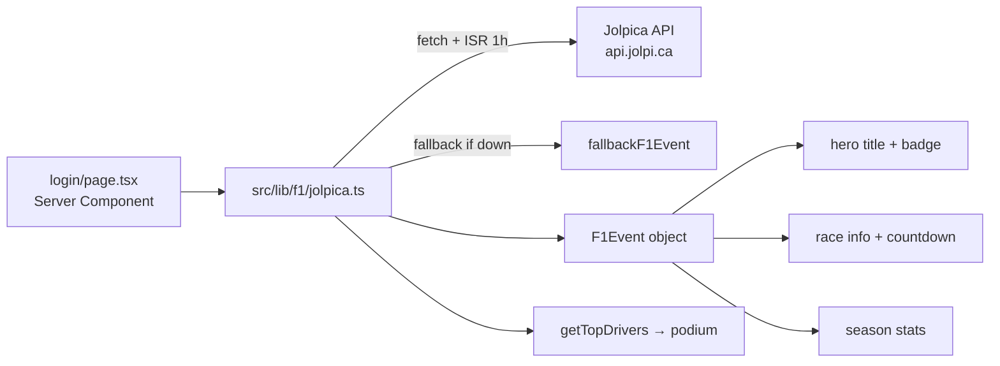
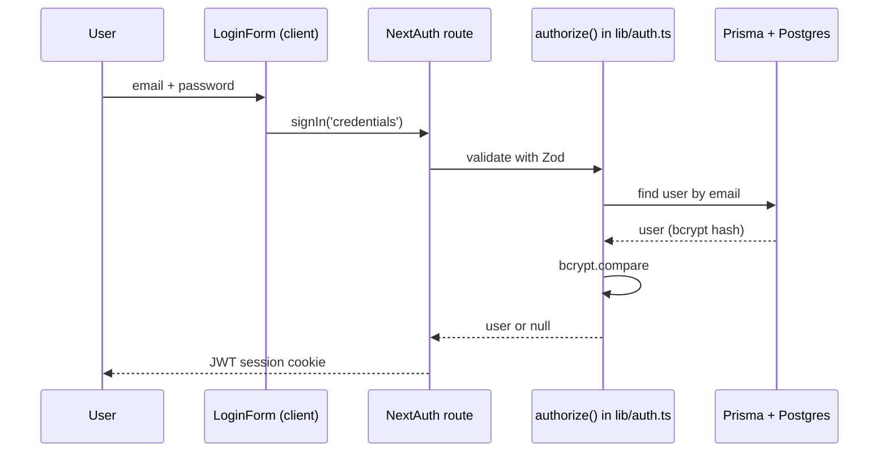

# 🏁 Welcome — How the Website Works

> [!info] Read this first
> This is the **start-here** guide for anyone new to the project — a human or an
> AI agent. It explains what the website is, how the code is organized, how to run
> it, and the two data layers that power it. Everything else in the wiki builds on
> this page.

[[README|📚 Wiki Index]] · [[PROJECT_OVERVIEW|Project Overview]] · [[DEVELOPMENT|Development Guidelines]]

---

## 1. What is F1Community?

An **F1 Community website** built on **Next.js 14 (App Router)** that hosts **three
experiences** under one roof — all reachable with **one account**:

| # | Experience            | What it is                                                              |
| :- | :-------------------- | :---------------------------------------------------------------------- |
| 1 | **F1 Community**      | The hub — schedule, standings, news, live timing, community features    |
| 2 | **F1 Store Community**| The community-driven store experience                                   |
| 3 | **F1 Official Store** | The official F1 merch store experience                                  |

> [!note] One account, three places
> A user signs in **once** and can move freely between the Community hub, the
> Store Community, and the Official Store without logging in again. Shared
> auth is a core pillar (see [[SECURITY|Security Plan]]).

Today the live, working surface is:

| Route      | What it does                                                        |
| :--------- | :------------------------------------------------------------------ |
| `/`        | Redirects to `/login` (the landing route)                           |
| `/login`   | Racing-themed hero + login card; hero shows **live F1 schedule data** and a ticking countdown |
| `/register`| Create an account (bcrypt-hashed password stored in Postgres)       |
| `/home`    | Post-login member home                                              |

## 2. The two data layers (important!)

> [!warning] Do not confuse these
> The site has **two independent data layers**. The login page's F1 content
> **does NOT come from the database** — it comes from a public racing API. Only
> user **authentication** uses the database. Each lives in different code.

### Layer A — Jolpica F1 API (public, no DB)



- **Files:** `src/lib/f1/jolpica.ts`, `src/components/f1/Countdown.tsx`
- **Data:** current race weekend, session times, season stats, top-3 standings
- **Caching:** ISR `revalidate: 3600` (once an hour — Jolpica allows ~500 req/hr)
- **Failure mode:** a static `fallbackF1Event()` so the page never crashes
- **Cost:** free, no authentication, no API key

### Layer B — Neon Postgres + Prisma (the user database)

```mermaid
flowchart LR
    F[LoginForm / RegisterForm<br/>client] --> A[NextAuth /api/auth/[...nextauth]]
    A --> AU[src/lib/auth.ts<br/>authorize]
    AU --> DB[Prisma Client<br/>src/lib/db.ts singleton]
    DB --> PG[(Neon Postgres)]
    R[register action<br/>src/app/actions/auth.ts] --> DB
```

- **Files:** `prisma/schema.prisma`, `src/lib/db.ts`, `src/lib/auth.ts`, `src/app/actions/auth.ts`
- **Data:** `users`, `accounts`, `sessions`, `verification_tokens` (+ future store: products, orders, carts)
- **Auth flow:** NextAuth credentials → Zod validation → bcrypt compare → JWT session
- **See:** [[DATABASE|Database Guide]] for the full story

> [!tip] Rule of thumb
> **Public F1 content** → Jolpica API layer. **User data (logins, orders)** → Postgres layer.
> If you're fetching race info, you almost certainly want Layer A — not a new Prisma model.

## 3. How authentication works (end to end)



- **Registration** mirrors this: `registerUser()` hashes with bcrypt (cost **12**), inserts into `users`, and returns a friendly error on duplicate email/username (`P2002`).
- **Demo users** (from `pnpm db:seed`): `admin@f1store.com` / `admin123` and `customer@f1store.com` / `customer123`.
- **Security controls** are tracked in [[SECURITY|Security Plan]].

## 4. How to run it

> [!note] Prerequisites
> Node.js 18+, `pnpm` (or npm), and a Postgres connection string — either
> **Neon** (cloud, see `.neon` / `DATABASE_URL`) or the **local Docker** Postgres 16.

```bash
# 1. Install dependencies (postinstall runs `prisma generate`)
pnpm install

# 2. Create your environment
# Copy .env.example → .env.local and set DATABASE_URL (+ NEXTAUTH_SECRET)

# 3a. Option A — cloud DB (Neon): just point DATABASE_URL at Neon
# 3b. Option B — local DB (Docker): start Postgres 16
docker compose up -d

# 4. Apply schema + seed demo data
pnpm db:migrate        # or pnpm db:push for prototyping
pnpm db:seed           # teams/drivers + demo users (destructive on existing data!)

# 5. Run the dev server
pnpm dev               # → http://localhost:3000
```

**Verify it's healthy:**

```bash
pnpm typecheck         # TS strict — silent = pass
```

> ⚠️ **Windows note:** this project runs on PowerShell. Inline `$variables` get
> stripped in some shells — write `.ps1` scripts for non-trivial commands (see
> [[DEVELOPMENT|Development Guidelines]]).

## 5. Where things live (quick code map)

| Concern            | File(s)                                                              |
| :----------------- | :------------------------------------------------------------------- |
| App router / pages | `src/app/page.tsx`, `src/app/login/page.tsx`, `src/app/register/page.tsx`, `src/app/home/page.tsx` |
| Login styles       | `src/app/login/login.css` (every `login-*` class has a rule here)    |
| Auth config        | `src/lib/auth.ts` (NextAuth v4 + credentials + JWT)                  |
| Auth route         | `src/app/api/auth/[...nextauth]/route.ts`                            |
| Register action    | `src/app/actions/auth.ts`                                            |
| Zod schemas        | `src/lib/validations/auth.ts`                                        |
| Prisma client      | `src/lib/db.ts` (singleton, serverless-safe)                         |
| DB schema          | `prisma/schema.prisma`                                               |
| F1 schedule client | `src/lib/f1/jolpica.ts`                                              |
| Countdown          | `src/components/f1/Countdown.tsx` (client)                           |
| Auth UI            | `src/components/auth/` (LoginForm, RegisterForm, SocialAuth, AuthHeader) |
| Layout shell       | `src/components/layout/` (AppShell, SiteHeader, SiteFooter)          |

### Key concepts for new contributors

- **Server Components are the default.** Data fetching and DB access happen on the
  server. Only reach for `'use client'` when you need hooks/events (see
  [[DEVELOPMENT|F1-Specific Guidelines]]).
- **Readable CSS naming.** Class/variable names describe the content they hold.
  Every `login-*` class used in `page.tsx` must exist in `login.css`.
- **No git from the AI.** Per `rules.md`, the working copy on `A:` is never
  committed/pushed by an agent — the user commits their own work.

## 6. Next steps

| You want to…                                  | Read this                                          |
| :-------------------------------------------- | :------------------------------------------------- |
| See the overall vision & scope                | [[PROJECT_OVERVIEW\|Project Overview]]             |
| Know what's built and what's next             | [[PROGRESS\|Progress Tracker]] + [[TASKS\|Task Board]] |
| Understand the phased roadmap                 | [[ROADMAP\|Roadmap & Plans]]                       |
| Dig into the database                         | [[DATABASE\|Database Guide]]                       |
| Check security posture                        | [[SECURITY\|Security Plan]]                        |
| Learn the SEO plan                            | [[SEO\|SEO Plan]]                                  |
| See known gaps (what's missing)               | [[GAPS\|Gaps & Missing Work]]                      |
| Follow the login-page design journey          | [[LOGIN_LANDING_PAGE\|Login Landing Page]] & [[LOGIN_DYNAMIC_F1_CONTENT\|Dynamic F1 Content]] |
| Work through the beginner-friendly walkthrough| [[GUIDE\|Developer & Architecture Guide]]          |

---

*Last updated: 2026-09-23 · Part of the [[README|F1Store Wiki]]*